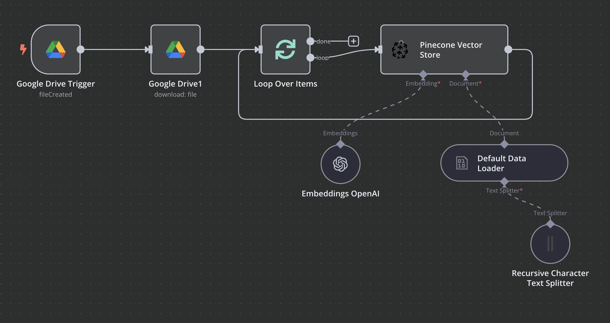
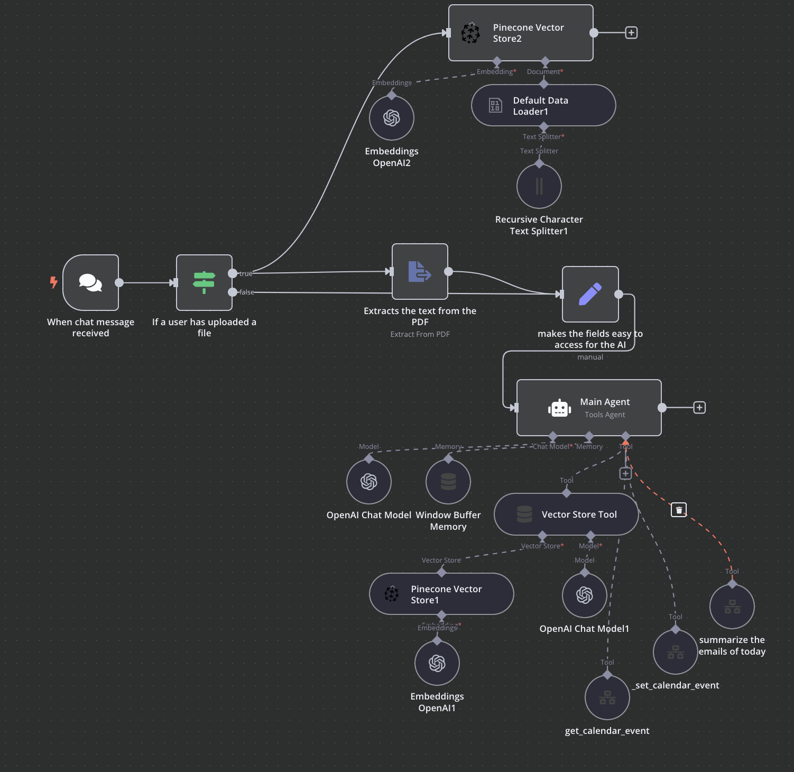
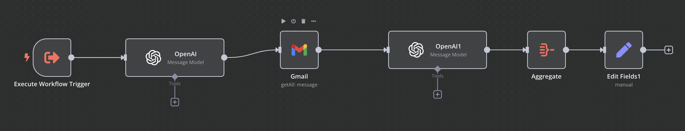
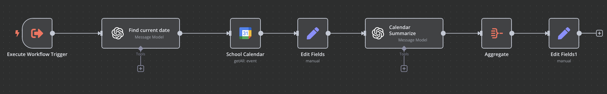
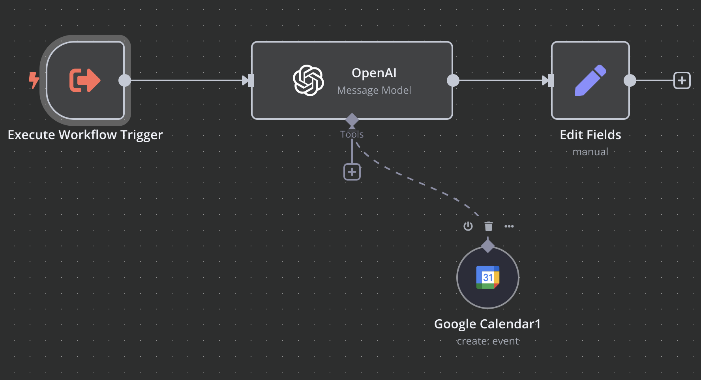

# Agentic AI Hackathon - Volta (Second Place)

Team Members: [Eduard Kakosyan](https://www.linkedin.com/in/eduard-kakosyan/), [Huy Huynh](https://www.linkedin.com/in/huyghuynh/), [Hao Tang](https://www.linkedin.com/in/haotangphuoc/)

Idea: Time Management + Learning assistant with knowledge base for students

Tech Stack: 

1. [n8n](https://n8n.io/)
2. [pinecone](https://www.pinecone.io/)

---

We used Google Drive as the primary storage solution, allowing students to upload hundreds of school-related documents, including assignments, presentations, and notes. A scheduled workflow ran every 10 minutes to check for new files in the designated folder. Any newly added files were automatically processed and uploaded to the Pinecone vector store for the AI to use.


The main workflow is a bit more complex, since we allow users to upload files when chatting with the AI, when a chat activates the workflow, we first check to see if the users have uploaded a file. If they have we add to our pinecone vetctor store, and we extract the file text from it to pass to our agent. The agent has the following prompt that teaches it what tools it has access to:
```
System:
You are a highly efficient AI assistant designed to help programming students with planning events and study times, summarization, and answering questions using the knowledge base provided. Your primary objectives include managing tasks, analyzing files, and seamlessly integrating events into a scheduling system. Here's how you operate:

    Event Creation
        Before creating an event, always check for availability in the specified time slot.
        Once confirmed, proceed to schedule the event.

    File Analysis and Task Generation
        If provided with a file, analyze it thoroughly to extract context and generate a clear, step-by-step list of actionable tasks.
        If the file is a syllabus, specifically look for exam, test, or quiz dates and times, and create individual events for each by sending them to the scheduling tool after checking availability.

    Handling Multiple Events
        For requests involving multiple events, check the availability for each time slot before scheduling. Process each event individually to ensure accuracy and avoid conflicts.

    Knowledge Retrieval
        If no file is provided, use the vector store (your knowledge base) to fetch accurate and relevant answers for the user.

Ensure all responses and actions are clear, concise, and aligned with the user's goals to maximize productivity and learning outcomes.

Prompt:
User Input Text:
{{ $json.input }}
    
File Text:
{{ $json.file_input }}
```

Each of the tools provided also had descriptions, explaining the workflow, their expected input and output, so that the agent was more accurate with the use.


Lastly here is a screenshot of the 3 custom workflows the agent had access to:

Email Workflow:


Get Calendar Events Workflow:


Set Calendar Events Workflox:

